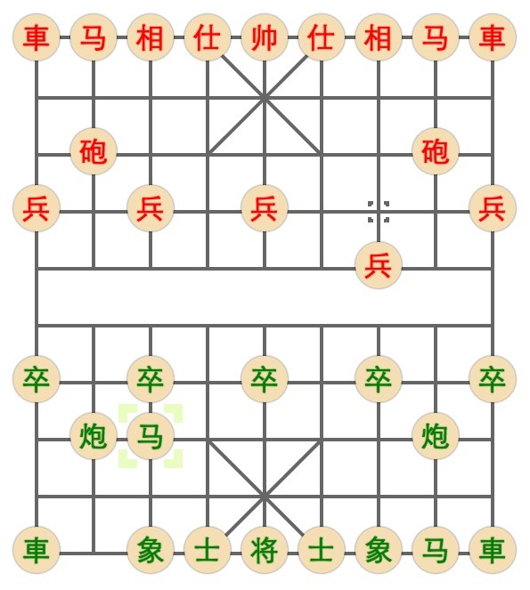

# 尝试做个象棋

## 亮点

- 纯Web实现
- 纯HTML+CSS绘制

## 功能

- [x] 棋盘/棋子绘制
- [x] 棋子摆布 
- [ ] 走棋规则
 - [x] 兵/卒
 - [x] 帅/将
 - [x] 相/象
 - [x] 马
 - [ ] 車
 - [ ] 砲/炮
- [ ] 简单机器人AI
- [ ] 玩家在线对弈

## 阶段/版本

- [x] 恶心杂乱的原生JavaScript(故意的)
- [ ] jQuery+Underscore
- [ ] 模块化改造
- [ ] Angular+Redux
- [ ] React+Redux
